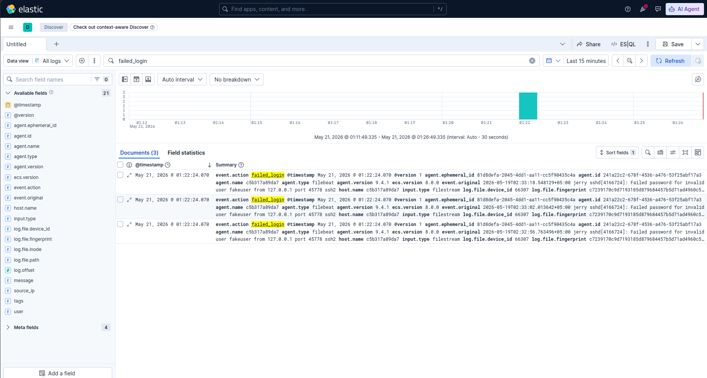
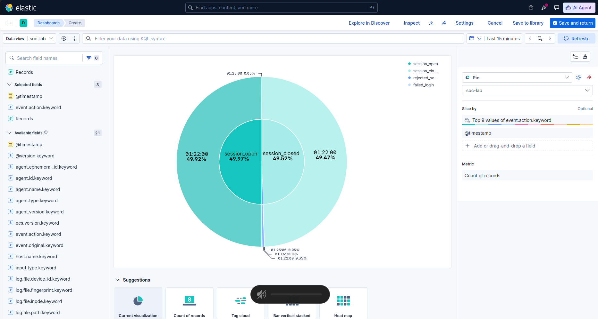

# ELK SOC Lab 

A foundational ELK Stack (Elasticsearch, Logstash, Kibana) laboratory designed for security log analysis, detection engineering, and SOC (Security Operations Center) workflow simulation.

## Features Implemented

The following capabilities have been successfully integrated into this lab environment:

- **Local Auth Log Ingestion:** Filebeat is configured to mount and continuously read the host's `/var/log/auth.log` file, bringing real-time system authentication data into the pipeline.
- **Logstash Parsing & Enrichment:** A custom Logstash pipeline (`logstash.conf`) is set up to parse incoming syslog messages using Grok patterns. It successfully categorizes:
  - Failed SSH passwords
  - Accepted SSH passwords
  - Sessions opened/closed
  - Rejected send messages
- **Synthetic Log Generation:** A Python-based log generator (`logs/logs_generator.py`) is included to continuously simulate various security events (e.g., malware detection, port scans, brute force attempts) into a `security_logs.json` file.
- **Sigma Detection Rules:** Initial integration of generic detection logic using Sigma rules (`sigma-rules/`). Currently features a rule for detecting "Multiple Failed Login Attempts From Single Source" mapped to MITRE ATT&CK (T1110.001).
- **Containerized Stack:** The entire Elastic stack (Elasticsearch, Kibana, Logstash, Filebeat) is orchestrated via Docker Compose for easy spin-up and teardown.

## Architecture Overview

- **Filebeat:** Collects logs from the host (`/var/log/auth.log`).
- **Logstash:** Receives logs from Filebeat on port 5044, parses them using Grok, and enriches them with specific action fields (e.g., `failed_login`, `session_open`, `session_closed` and `rejected_send_message`).
- **Elasticsearch:** Indexes the parsed logs into daily indices (`logs-YYYY.MM.dd`).
- **Kibana:** The frontend visualization layer to query and dashboard the ingested data.

## Getting Started

1. **Install Dependencies:**
   Ensure Docker and Docker Compose are installed. Install Python requirements for the log generator:
   ```bash
   pip install -r requirements.txt
   ```

2. **Start the Stack:**
   ```bash
   docker-compose up -d
   ```

3. **Generate Synthetic Logs:**
   In a separate terminal, run the simulator to start generating mock security events:
   ```bash
   python3 logs/logs_generator.py
   ```

4. **Access Kibana:**
   Open your browser and navigate to `http://localhost:5601`. Navigate to "Discover" and check the `logs-*` index pattern to view incoming data.

## Project Structure

- `docker-compose.yml`: Main orchestration file for the ELK services.
- `filebeat.yml`: Configuration for log collection.
- `logstash/pipeline/logstash.conf`: Custom parsing logic and field mapping for `auth.log` data.
- `sigma-rules/`: A collection of Sigma rules for detection logic.
- `logs/`: Directory containing the log generator and generated log files.
- `requirements.txt`: Dependencies for the Python log generator.

